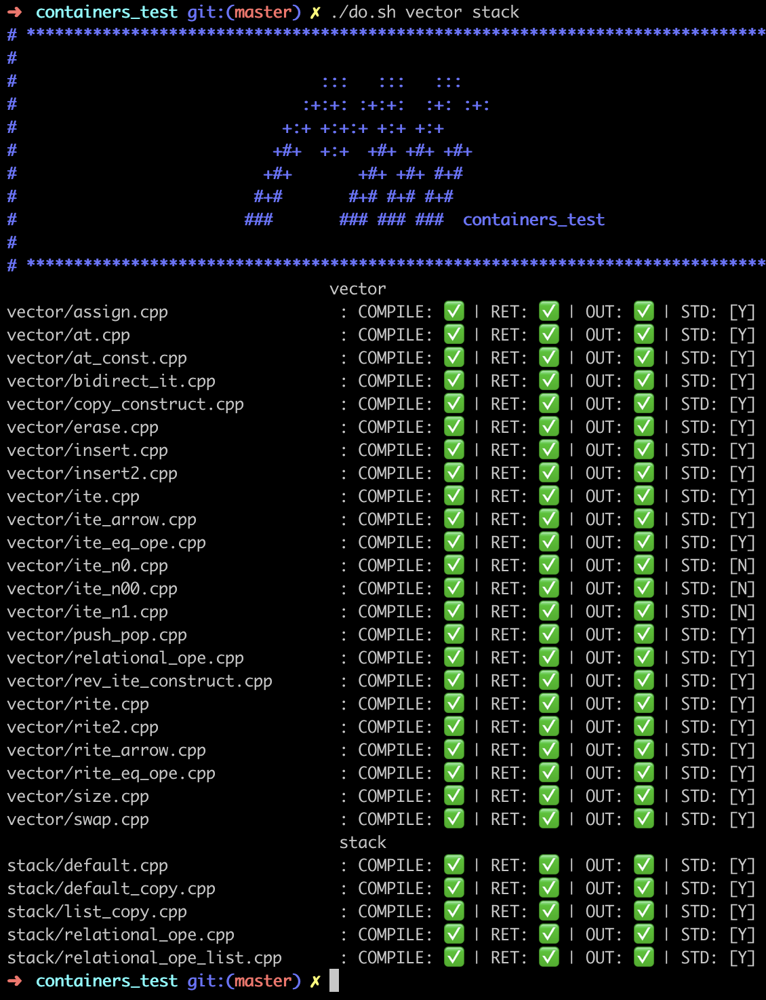

# FT_CONTAINERS


## Screenshots



## Description

ft_containers is a project written in C++ which require you to reimplement a few containers from the STL.

They must have all public member functions from C++98.

The corresponding iterators must also be implemented.

## Containers

#### vector

The C++ Standard Library vector class is a class template for sequence containers. A vector stores elements of a given type in a linear arrangement, and allows fast random access to any element. A vector is the preferred container for a sequence when random-access performance is at a premium

```http
  template <class Type, class Allocator = allocator<Type>>
  class vector
```

#### Stack

Stacks are a type of container adaptors with LIFO(Last In First Out) type of working, where a new element is added at one end (top) and an element is removed from that end only.  Stack uses an encapsulated object of either vector or deque (by default) or list (sequential container class) as its underlying container, providing a specific set of member functions to access its elements.

```http
template <class Type, class Container = ft::vector<Type> > class stack;
```

#### Map

Maps are associative containers that store elements formed by a combination of a key value and a mapped value, following a specific order.

In a map, the key values are generally used to sort and uniquely identify the elements, while the mapped values store the content associated to this key. The types of key and mapped value may differ, and are grouped together in member type value_type, which is a pair type combining both:

1
typedef pair<const Key, T> value_type;

Internally, the elements in a map are always sorted by its key following a specific strict weak ordering criterion indicated by its internal comparison object (of type Compare).

map containers are generally slower than unordered_map containers to access individual elements by their key, but they allow the direct iteration on subsets based on their order.

The mapped values in a map can be accessed directly by their corresponding key using the bracket operator ((operator[]).

Maps are typically implemented as binary search trees.


